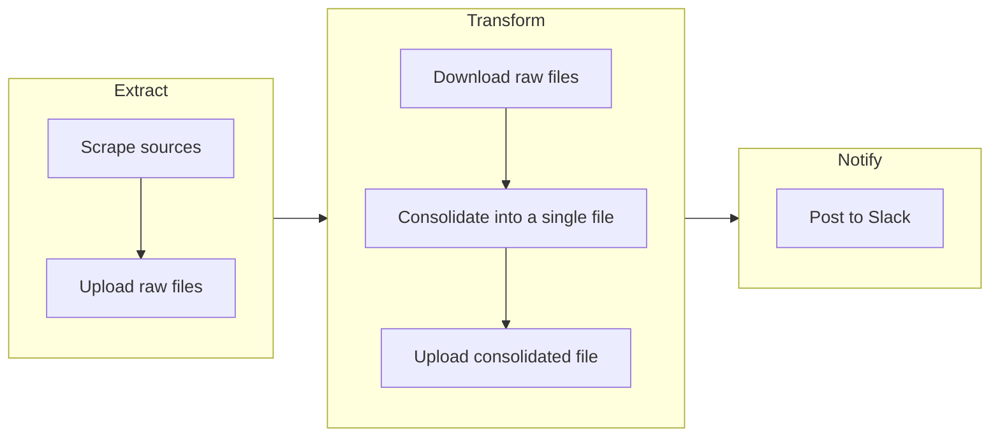

A GitHub Action workflow for automating a WARN Act notice ETL pipeline.

## How it works

The [extract, transform and load](https://github.com/biglocalnews/warn-github-flow/actions/workflows/etl.yml) Action runs daily. It does the following:

- 🔪 Gather raw WARN Notices from all of our sources with [warn-scraper](https://github.com/biglocalnews/warn-scraper)
- ⏫ Upload the files to our archive on [biglocalnews.org](https://biglocalnews.org) with [upload-files](https://github.com/biglocalnews/upload-files)
- 📟 Send a Slack alert to [#alerts-data-etl](https://biglocalnews.slack.com/archives/C016QMH6DHU)

## About

The project is sponsored by [Big Local News](https://biglocalnews.org/#/about), a program at Stanford University that collects data for impactful journalism. The code is maintained by [Ben Welsh](https://palewi.re/who-is-ben-welsh/), a visiting data journalist from the Los Angeles Times.
